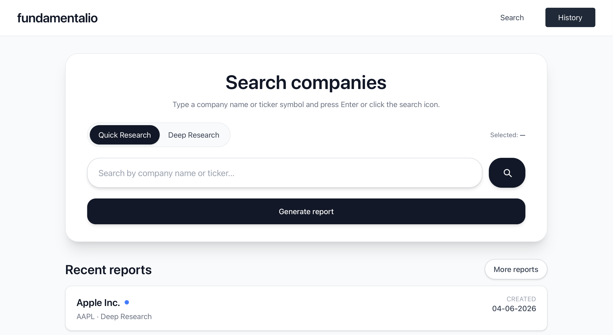
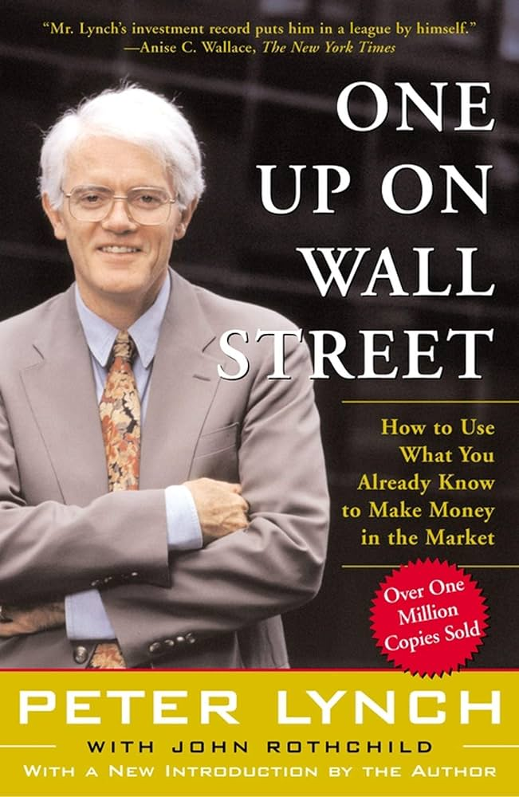
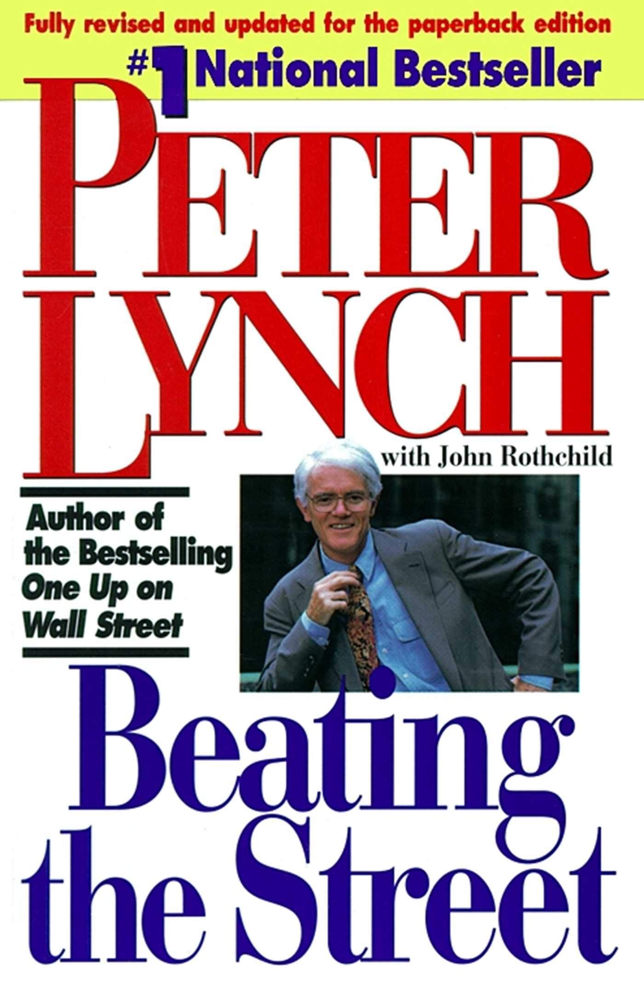
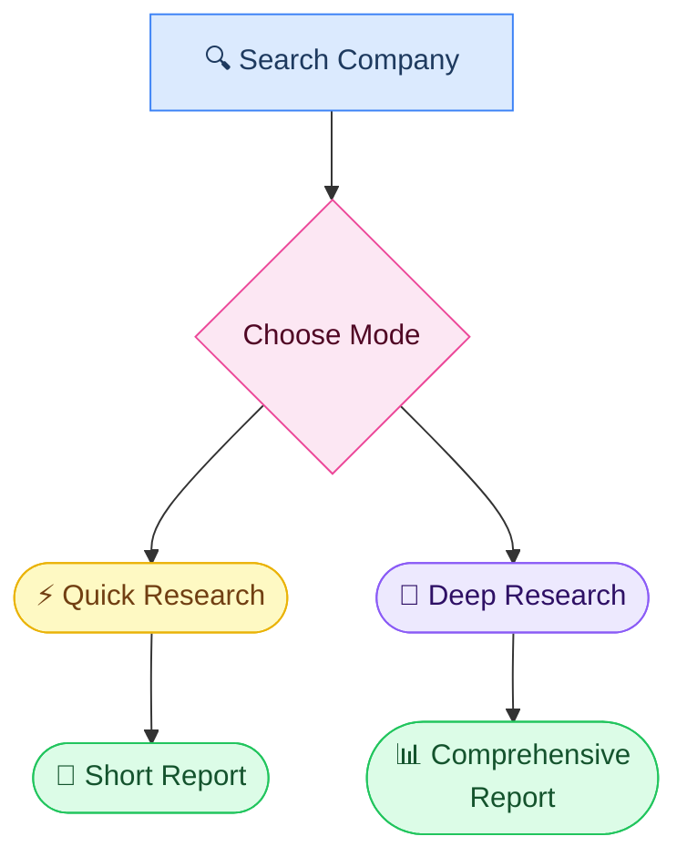
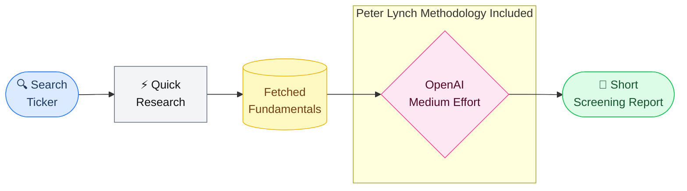
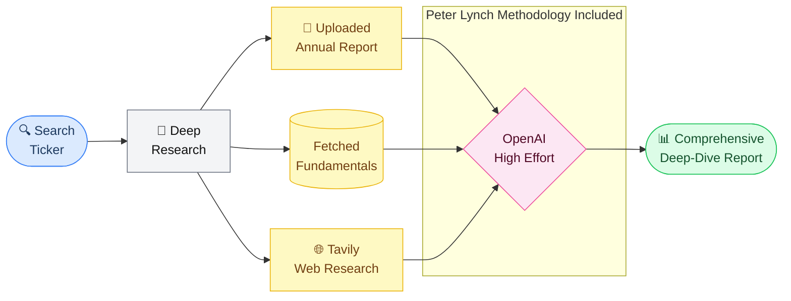

<div align="center">
  <br />
  <h1><strong>fundamentalio</strong></h1>
  <p><em>Open-source AI tool for Peter Lynch-style stock analysis</em></p>

  [](https://djangoproject.com)
  [](https://openai.com)
  [](LICENSE)

</div>

<br/>

<br />

---

## Table of Contents

- [About Peter Lynch](#about-peter-lynch)
- [How It Works](#how-it-works)
  - [Quick Research](#-quick-research)
  - [Deep Research](#-deep-research)
  - [Quick vs Deep](#quick-vs-deep)
- [Installation](#installation)
  - [Prerequisites](#prerequisites)
  - [macOS](#macos)
  - [Windows](#windows)
- [Disclaimer](#disclaimer)
- [License](#license)

---

## About Peter Lynch

Peter Lynch ran the **Fidelity Magellan Fund** from 1977 to 1990, delivering an average annual return of 29.2%, beating the S&P 500 index — making it one of the best-performing mutual funds in history.

His investment philosophy is grounded in a simple but powerful idea: ordinary investors have a real edge when they pay attention to the world around them.

- **Invest in what you understand** — focus on businesses whose products, services, and revenue model you can clearly explain.
- **Focus on fundamentals** — prioritize earnings growth, financial health, and business quality over short-term market movements or predictions.
- **Growth at a reasonable price (GARP)** — seek companies that combine solid growth with sensible valuation.
- **Think long-term** — durable business performance matters far more than short-term market noise.
- **Use your individual advantage** — everyday observations can help you spot great investments before Wall Street does.


> *"The person that turns over the most rocks wins the game."* — Peter Lynch


He is best known for the books: **Learn to Earn**, **One Up on Wall Street**, and **Beating the Street**.

<br />

<table align="center">
  <tr>
    <td align="center" width="220">
      <br />
      <sub><b>Peter Lynch</b></sub><br />
    </td>
    <td align="center" width="160">
      <br />
      <sub><b>One Up on Wall Street</b></sub><br />
    </td>
    <td align="center" width="160">
      <br />
      <sub><b>Beating the Street</b></sub><br />
    </td>
  </tr>
</table>

<br />

I created this project to see whether AI could generate stock research reports inspired by **Peter Lynch's** investing philosophy.
After a few months of analyzing his books, iterating on prompts, and building the application, it started producing surprisingly useful reports.

---

## How It Works

Search a company by **name or ticker**, choose a research mode, and receive an **AI-generated report** saved to your history for later review.



---

### ⚡ Quick Research

Role of a fast screening report is to answer one question: *"Is this stock worth deeper research?"*

| | |
|---|---|
| **Data** | Fundamentals fetched via `yfinance` |
| **AI** | Single OpenAI call, medium reasoning effort |
| **Output** | Short screening report (~300 words) |



Prompts used for **Quick Research:**  
[Quick Research Core Methodology](fundamentalio/services/research_helpers/quick_research/prompts/quick_research_methodology.md)  
[Quick Research System Prompt](fundamentalio/services/research_helpers/quick_research/prompts/quick_research_system_prompt.md)

Example **Quick Research** reports:  
- Example 1: [The Coca-Cola Company](fundamentalio/static/PDF/pdf1.pdf)
- Example 2: [3M Company](fundamentalio/static/PDF/pdf2.pdf)
- Example 3: [Microsoft Corporation](fundamentalio/static/PDF/pdf3.pdf)


---

### 🔬 Deep Research

A comprehensive report designed to deeply understand the stock.

| | |
|---|---|
| **Data** | Fundamentals fetched via `yfinance` + Tavily web research + Uploaded annual report |
| **AI** | Single OpenAI call, high reasoning effort |
| **Output** | Full deep-dive report (10+ pages)|



Prompts used for **Deep Research:**  
- [Deep Research Core Methodology](fundamentalio/services/research_helpers/deep_research/prompts/deep_research_methodology.md)  
- [Deep Research System Prompt](fundamentalio/services/research_helpers/deep_research/prompts/deep_research_system_prompt.md)


Example **Deep Research** report:  
- Example 1: [Microsoft Corporation](fundamentalio/static/PDF/pdf4.pdf)

---

### Quick vs Deep

| | ⚡ Quick Research | 🔬 Deep Research |
|:---|:---:|:---:|
| **Goal** | Screen candidates | Full due diligence |
| **User Input** | Ticker only | Ticker + annual report PDF |
| **yfinance** | ✅ | ✅ |
| **Tavily web research** | ❌ | ✅ |
| **PDF analysis** | ❌ | ✅ |
| **AI reasoning effort** | Medium | High |
| **Estimated time** | ~1 minute | 5+ minutes |
| **Report length** | ~300 words | 10+ pages |
| **Best for** | Initial filter | Deep understanding |
| **Estimated costs for OpenAI LLM**  (gpt-5-mini) | ~$0.015 | ~$0.10 |

---

## Installation  

### Prerequisites

| Requirement | Version | Notes |
|:---|:---:|:---|
| Python | 3.12+ | Backend runtime |
| Node.js | 22+ | Tailwind CSS asset build |
| `OPENAI_API_KEY` | — | Required for both modes |
| `TAVILY_API_KEY` | — | Required for Deep Research only (free version is enough) |

---

### macOS

```bash
# 1. Clone & enter project
git clone <repo-url>
cd fundamentalio

# 2. Create and activate virtual environment
python3 -m venv venv
source venv/bin/activate

# 3. Install dependencies
pip install --upgrade pip && pip install -r requirements.txt

# 4. Configure environment
cp .env.example .env        # open .env and fill in your API keys

# 5. Set up database and frontend
python manage.py migrate
python manage.py tailwind install
```

**Start the app (two terminals):**

```bash
# Terminal 1 — Django dev server
source venv/bin/activate && python manage.py runserver

# Terminal 2 — Tailwind CSS watcher
source venv/bin/activate && python manage.py tailwind start
```

🌐 Open **[http://127.0.0.1:8000](http://127.0.0.1:8000)**

---

### Windows

```powershell
# 1. Clone & enter project
git clone <repo-url>
cd fundamentalio

# 2. Create and activate virtual environment
python -m venv venv
venv\Scripts\activate

# 3. Install dependencies
pip install --upgrade pip && pip install -r requirements.txt

# 4. Configure environment
copy .env.example .env      # open .env and fill in your API keys

# 5. Set up database and frontend
python manage.py migrate
python manage.py tailwind install
```

**Start the app (two terminals):**

```powershell
# Terminal 1 — Django dev server
venv\Scripts\activate; python manage.py runserver

# Terminal 2 — Tailwind CSS watcher
venv\Scripts\activate; python manage.py tailwind start
```

🌐 Open **[http://127.0.0.1:8000](http://127.0.0.1:8000)**

---

## Disclaimer

> [!WARNING]
> **Please read carefully before using this tool.**
1. This project is an independent, open-source tool inspired by the investing principles popularized by **Peter Lynch**.
2. It is not affiliated with, endorsed by, sponsored by, or associated with **Peter Lynch**, **Fidelity Investments**, or any related organization.
3. All trademarks, names, and references belong to their respective owners and are used for educational and informational purposes only.  
4. This project uses the [**yfinance**](https://github.com/ranaroussi/yfinance) library. Yahoo! finance API is intended for personal use only.
5. Reports are **AI-generated** and may contain errors or inaccuracies. Always verify information independently before acting on it.
6. This does not constitute financial, investment, or trading advice. Users are solely responsible for their own investment decisions.

---

## Star ⭐️

If you find this project useful, please consider starring it — you'll find it quickly later, and it helps others discover it too.

## License

Distributed under the **MIT License** — see [`LICENSE`](LICENSE) for details.

---

<p align="center">
  <sub>
    Created by <a href="https://www.linkedin.com/in/szymon-nycz/">Szymon Nycz</a>
    · Inspired by Peter Lynch's philosophy
  </sub>
</p>
